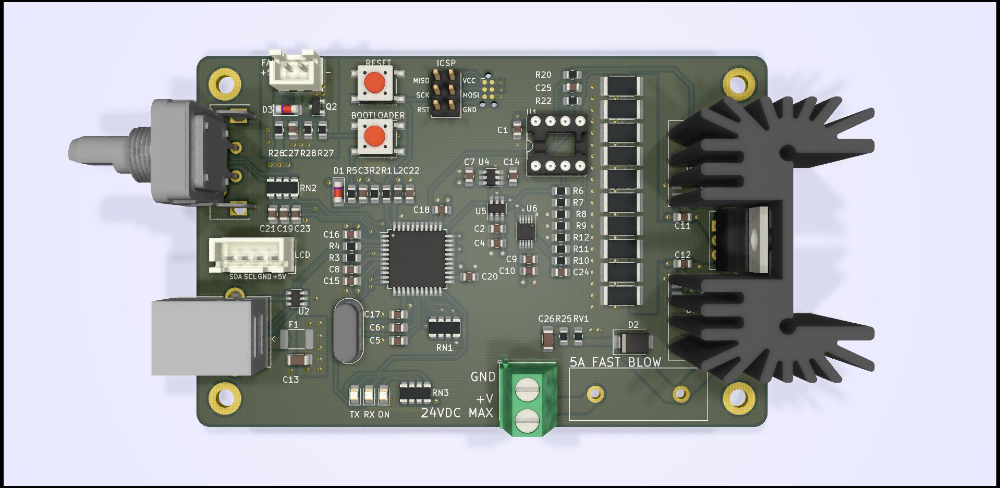
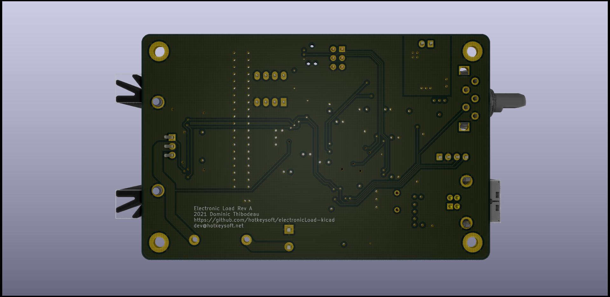
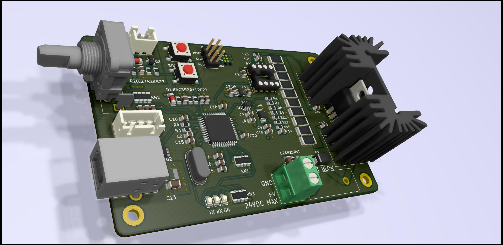

# Electronic Load
Rev A July 2021

***Work in progress, do not use***

- USB Powered (USB-B Connector)
- 0-24V DC Input
- Adjustable current range: 0-4A
- I2C OLED 0.96" Display
- Rotary Encoder w/switch
- Temperature Sensors w/hardware shutdown
- 5V Cooling fan (PWM Speed Control)

Images
============
|Front                                                 | Back                                              |
|------------------------------------------------------|---------------------------------------------------|
|||

### Schematics (pdf)
- [Complete schematics](./img/schema.pdf)

### PCB Images (svg)
- [Top](./img/pcb-front.svg)
- [GND Plane](./img/pcb-in1.svg)
- [VCC Plane](./img/pcb-in2.svg)
- [Bottom](./img/pcb-back.svg)
